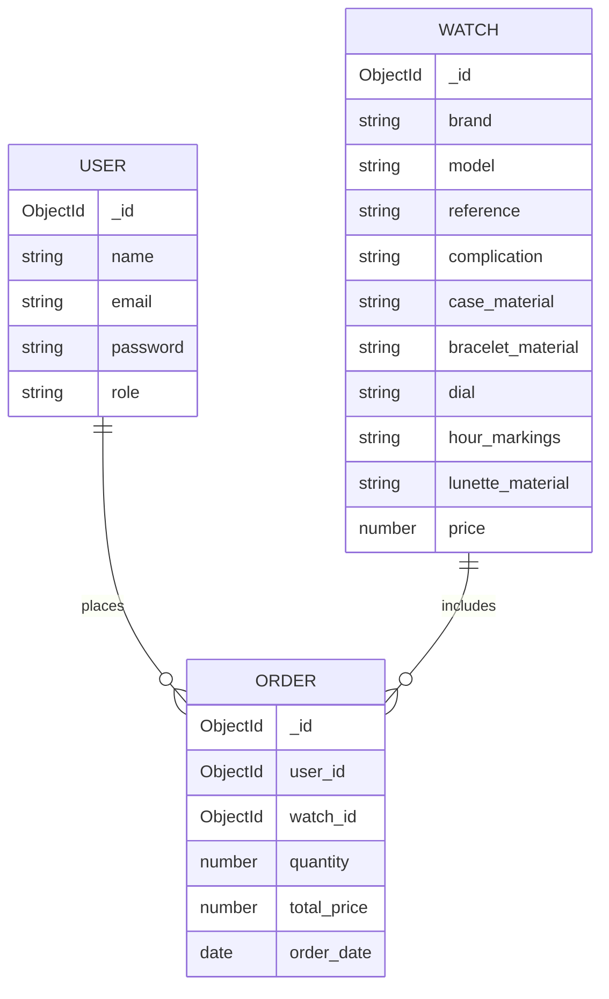

# Online Watch Store

## Project Overview
This project is an online watch store built with MongoDB, Express.js, and Node.js. It provides users with the ability to browse, purchase, and manage orders for various luxury and casual watches.

## Deployed link
https://watch-store-rcf4.onrender.com

## Structure of the project

```
WATCH_STORE/
│── config/                  # Конфигурационные файлы
│── controllers/             # Контроллеры для обработки логики
│   ├── authController.js    # Контроллер аутентификации
│   ├── orderController.js   # Контроллер заказов
│   ├── watchController.js   # Контроллер часов
│── models/                  # Модели базы данных (MongoDB)
│   ├── Order.js             # Модель заказов
│   ├── User.js              # Модель пользователей
│   ├── Watch.js             # Модель часов
│── routes/                  # Маршруты API
│   ├── authRoutes.js        # Маршруты аутентификации
│   ├── orderRoutes.js       # Маршруты заказов
│   ├── watchRoutes.js       # Маршруты часов
│── views/                   # Шаблоны страниц (EJS)
│   ├── home.ejs             # Главная страница
│   ├── login.ejs            # Страница входа
│   ├── orders.ejs           # Страница заказов
│   ├── register.ejs         # Страница регистрации
│── node_modules/            # Зависимости npm
│── create_json.py           # Скрипт для создания JSON
│── normalize_json.py        # Скрипт для нормализации JSON
│── normalized_watches_data.json # Нормализованные данные часов
│── package.json             # Файл конфигурации npm
│── package-lock.json        # Файл зависимостей npm
│── server.js                # Главный серверный файл
```


## ERD (Entity-Relationship Diagram)



🎯 Aim and Goals

Develop a backend application connected to a MongoDB database.

Implement CRUD operations and ensure query optimization.

Secure the application with authentication and authorization.

Deploy the application for real-world testing.

📌 Relevance

This project addresses real-world data management issues by leveraging NoSQL databases, providing scalability and performance improvements over traditional relational databases.

🔍 Research

Before development, a study was conducted on similar applications, analyzing their database structures, query optimizations, and security practices.


🚀 Application Features

CRUD Operations: Create, Read, Update, Delete functionality.

Security Implementation: Authentication & Authorization.

🛠 Technical Implementation

1️⃣ Backend Development

Built using Node.js.

Connected to MongoDB Atlas for cloud storage.

2️⃣  CRUD Operations

RESTful API endpoints for Create, Read, Update, and Delete.

3️⃣ Data Collection

Data sourced from relevant external APIs or datasets.

4️⃣ Security

User Authentication using JWT.

Authorization rules for access control.


## Database Schema

### User Collection
```js
const mongoose = require('mongoose');
const userSchema = new mongoose.Schema({
  name: String,
  email: String,
  password: String,
  role: { type: String, enum: ['user', 'admin'], default: 'user' }
});
module.exports = mongoose.model('User', userSchema);
```

### Watch Collection
```js
const mongoose = require('mongoose');
const watchSchema = new mongoose.Schema({
  brand: String,
  model: String,
  reference: String,
  complication: String,
  case_material: String,
  bracelet_material: String,
  dial: String,
  hour_markings: String,
  lunette_material: String,
  price: Number,
});
module.exports = mongoose.model('Watch', watchSchema, 'Watches');
```

### Order Collection
```js
const mongoose = require('mongoose');
const Schema = mongoose.Schema;

const orderSchema = new mongoose.Schema({
    user_id: { type: mongoose.Schema.Types.ObjectId, ref: 'User', required: true },
    watch_id: { type: mongoose.Schema.Types.ObjectId, ref: 'Watch', required: true },
    quantity: { type: Number, required: true },
    total_price: { type: Number, required: true },
    order_date: { type: Date, default: Date.now }
});  

module.exports = mongoose.model('Order', orderSchema, 'orders');
```

## Installation and Setup

1. Clone the repository:
```bash
git clone git@github.com:lyalia123/Watch_store.git
cd watch_store
```

