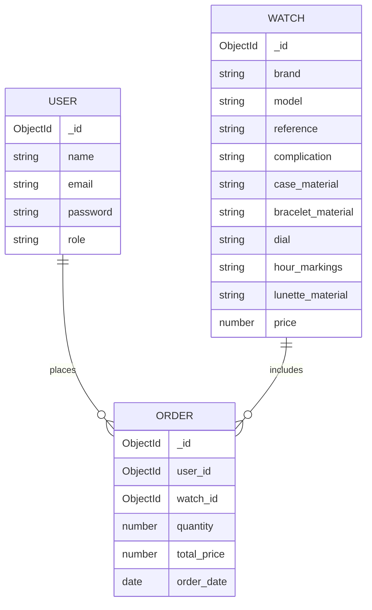

# Online Watch Store

## Project Overview
This project is an online watch store built with MongoDB, Express.js, and Node.js. It provides users with the ability to browse, purchase, and manage orders for various luxury and casual watches.

## ERD (Entity-Relationship Diagram)


## Use-Case Diagram
```mermaid
usecaseDiagram
    actor "Admin" as Admin
    actor "User" as User
    
    Admin --> (Manage Watches: Create, Read, Update, Delete)
    User --> (Place Order)
    
    (Manage Watches: Create, Read, Update, Delete) --> (CRUD Operations on Watches)
    (Place Order) --> (Create Order)
## Database Schema

### User Collection
```js
const mongoose = require('mongoose');
const userSchema = new mongoose.Schema({
  name: String,
  email: String,
  password: String,
  role: { type: String, enum: ['user', 'admin'], default: 'user' }
});
module.exports = mongoose.model('User', userSchema);
```

### Watch Collection
```js
const mongoose = require('mongoose');
const watchSchema = new mongoose.Schema({
  brand: String,
  model: String,
  reference: String,
  complication: String,
  case_material: String,
  bracelet_material: String,
  dial: String,
  hour_markings: String,
  lunette_material: String,
  price: Number,
});
module.exports = mongoose.model('Watch', watchSchema, 'Watches');
```

### Order Collection
```js
const mongoose = require('mongoose');
const Schema = mongoose.Schema;

const orderSchema = new mongoose.Schema({
    user_id: { type: mongoose.Schema.Types.ObjectId, ref: 'User', required: true },
    watch_id: { type: mongoose.Schema.Types.ObjectId, ref: 'Watch', required: true },
    quantity: { type: Number, required: true },
    total_price: { type: Number, required: true },
    order_date: { type: Date, default: Date.now }
});  

module.exports = mongoose.model('Order', orderSchema, 'orders');
```

## Installation and Setup

1. Clone the repository:
```bash
git clone https://github.com/your-repo/online-watch-store.git
cd online-watch-store
```

2. Install dependencies:
```bash
npm install
```

3. Set up your MongoDB connection in `.env`:
```env
MONGO_URI=mongodb://localhost:27017/watchstore
```

4. Start the server:
```bash
npm start
